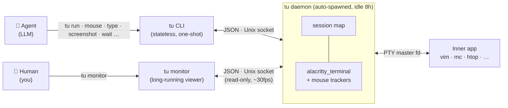

# terminal-use (`tu`)

`tu` is a full blown terminal emulator for AI agents. 

Spawn interactive terminal apps, read the screen, drive the keyboard *and* mouse. No GUI, no X server, no display needed.

`tu` is to terminal applications what [agent-browser](https://github.com/vercel-labs/agent-browser) is to web pages.

## Demo

An AI agent playing NetHack — character creation, dungeon exploration, combat — driven entirely through `tu`:

https://github.com/user-attachments/assets/8dd87972-2ef5-4104-9074-52b6ee528e08

## Features

- **Screen reads**: text or PNG screenshots of the rendered terminal.
- **Keyboard**: type text, send named keys (`Enter`, `F5`, `Ctrl+C`).
- **Mouse**: click, drag, move, scroll. Find buttons by their label instead of pixel-hunting for coords.
- **Wait**: block until a regex matches the screen or the screen stops changing.
- **Sessions**: multiple terminals at once. It's basically `tmux` for your agent.
- **Live monitor**: Want to visually check what your agent is seeing? Check the [tu monitor](#tu-monitor) command.

## Install

Prebuilt binaries available for Linux (x86_64/ARM) and macOS (ARM). One click installer, no Rust tooling needed:
```bash
curl -fsSL https://raw.githubusercontent.com/flipbit03/terminal-use/main/install.sh | sh
```

Or compiled directly in your box, from source:

```bash
cargo install terminal-use
```

To update `tu` to the latest version (regardless of the installation method):

```bash
tu self update
```

## Add to your agent

Add the following block to your `CLAUDE.md`/`AGENTS.md` (or similar) to inform your agent of the existence of `tu`:

```
# terminal-use (`tu`)

Some programs (htop, vim, mc, dialog-based installers, ncurses UIs) need a
real terminal to render their interface — you can't just pipe stdin/stdout.
Use `tu` to run them in a virtual terminal, screenshot the screen, send
keystrokes, and drive the mouse. Run `tu usage` before the first
interaction for the full command reference.
```

That's it!

## Quick taste

```bash
# Spawn an app
tu run htop

# Read what's on screen (text or PNG)
tu screenshot
tu screenshot --png -o shot.png

# Send keystrokes
tu press F2                     # F2
tu press Escape : w q Enter     # save + quit vim
tu type "hello world"

# Drive the mouse — by coords, or by what's on screen
tu mouse click 50 20
tu mouse click --on-text "OK"
tu mouse click --on-text "Buy" --clicks 2          # double-click a label
tu mouse drag 10 10 50 30                          # drag from → to
tu mouse scroll down --amount 5

# Inspect mouse state (mode, virtual cursor, held buttons)
tu mouse state

# Wait for screen state
tu wait --text "Complete" --timeout 10000
```

## `tu monitor`

Open a separate terminal and watch what your agent is doing in real time:

```bash
tu monitor                        # Watch the default session
tu monitor --name nethack         # Watch a specific session
```

- Full-color terminal rendering inside a framed window
- 30 fps refresh, diff-based emit — uses minimal bandwidth / efficient on SSH
- Shows the virtual mouse cursor (if active) as a magenta `△` (filled when a button is held)
- Left/Right arrows to switch between multiple sessions
- Handles terminal resize
- Ctrl+C to detach

## How it works

`tu` wraps a headless PTY + [`alacritty_terminal`](https://crates.io/crates/alacritty_terminal) emulator behind a CLI. A background daemon manages sessions — each CLI invocation is stateless. The agent driving things and the human watching share the same daemon:



- The emulator is alacritty's. It handles the full xterm command set, including modern shell-integration sequences.
- When the inner app queries terminal capabilities (Device Attributes, cursor reports, terminfo lookups), `tu` answers — so vim, less, mc and friends don't hang on startup waiting for a reply.
- The daemon auto-starts on first use and auto-exits after 8 hours of inactivity.

## Defaults

- **Terminal size**: 120x40
- **TERM**: `xterm-256color`
- **Session name**: `default` (unless `--name` specified)
- **Output**: Human-readable if TTY, JSON for the agent (non-interactive terminal)

## License

MIT
